# Slides UI Layout System Redesign

**Status:** Proposal  
**Last updated:** 2026-06-24  
**Scope:** Full-page slide editing experience in `src/components/presentation/slide-editor.tsx`.

This document defines the target UI layout system for slide editing. It merges the current slide editor architecture, the requested bottom dock and context-aware toolbar behavior, the revised left rail rules, and the useful patterns from Canva's editor reference.

The redesign does not change the persisted deck schema. `SlideEditor` remains the stateful shell. `SlideCanvas` remains read-only. The work is a UI ownership and layout redesign: where controls live, how surfaces relate, and how users move from global actions to direct canvas manipulation to deeper property editing.

## Summary

The editor becomes a stage-centered workspace with clear control ownership:

- The **top toolbar** owns global actions and slide creation. Its `Add` button is the only visible entry point for adding slides, and it must support blank slides and template-based slides.
- The **left slide rail** owns slide navigation and drag/drop reordering only. It should not contain an `Add slide` button or template picker.
- The **stage** owns direct manipulation: select, move, resize, rotate, inline edit, connector interaction, hover preselection, and selection chrome.
- The **context toolbar** appears top-centered below the page toolbar when a slide component is selected. It owns fast selected-object edits.
- The **right panel** adapts Canva's floating `Position` panel pattern, but places it on the right. It owns arrange precision, layers, source/asset details, metadata, and advanced settings.
- The **bottom dock** owns speaker notes, slide rail visibility, zoom slider, zoom presets, and compact slide/page status.

## Non-Goals And Invariants

- Do not change the persisted deck schema.
- Do not change `Slide.elements[]` as the authoritative rendering source.
- Do not introduce compatibility layers for superseded UI payloads.
- Do not replace direct canvas manipulation for move, resize, rotate, marquee, connector editing, or inline text editing.
- Do not duplicate the same editable property in the context toolbar and right panel.
- Do not add slide creation controls to the left rail.

Architectural invariants:

| Invariant                            | Meaning                                                                                                                              |
| ------------------------------------ | ------------------------------------------------------------------------------------------------------------------------------------ |
| `SlideEditor` owns state             | Deck value, selected slide, selection, history, autosave, rail visibility, panel visibility, zoom, and notes flow stay in the shell. |
| Child surfaces are controlled        | Rail, stage, context toolbar, right panel, and bottom dock receive state and callbacks.                                              |
| `SlideCanvas` is read-only           | Rendering remains shared with present/public/export surfaces.                                                                        |
| Mutations use existing command paths | UI controls continue routing through `commitCommand`, `executeCommand`, and existing slide editor handlers.                          |
| One property has one editor          | A control belongs to one primary surface; another surface may link to it but should not edit the same value again.                   |

## Design Principles

1. **Stage first.** The canvas should feel like the work surface. Chrome supports the work but should not visually compete with the slide.
2. **Persistent edges.** Navigation stays left, global actions stay top, notes and zoom stay bottom, deeper properties stay right.
3. **Context near the work, not on top of it.** Selected-object tools appear in a predictable top-centered toolbar below the page toolbar, not attached to the selected object.
4. **Progressive depth.** Frequent controls are immediate; precise, form-heavy, or source-aware controls are one layer deeper.
5. **No duplicated editing.** Toolbar controls and panel controls must have distinct jobs.
6. **Canva-inspired, product-adapted.** Borrow Canva's density, toolbar/panel split, bottom workspace controls, and arrange panel grouping, but keep our requested right-panel placement and top-centered context toolbar.

## Surface Map

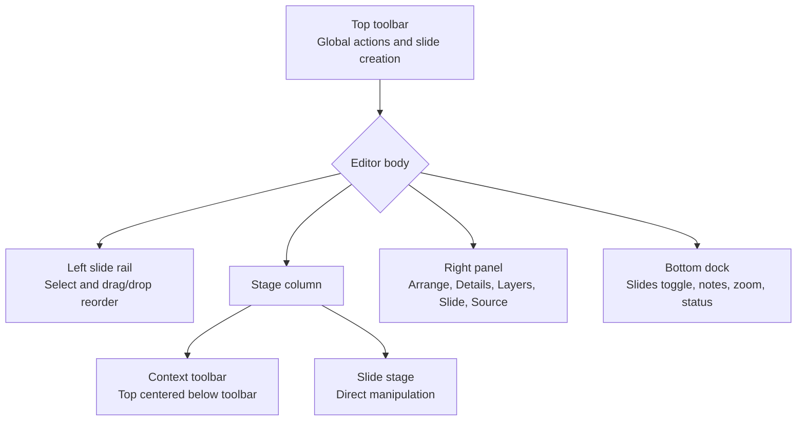

## Desktop Layout

Desktop uses a full-screen editor shell with top, left, center, right, and bottom regions.

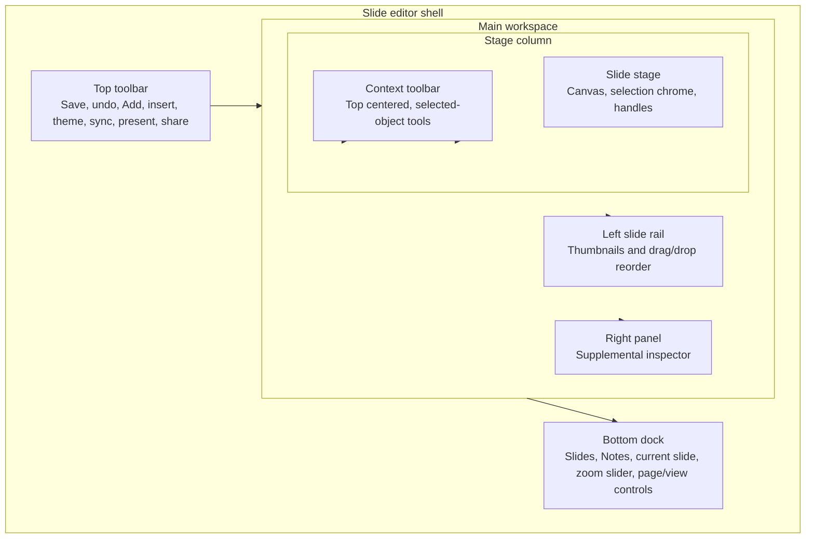

Surface responsibilities:

| Surface         | Owns                                                                                                         | Does not own                                                          |
| --------------- | ------------------------------------------------------------------------------------------------------------ | --------------------------------------------------------------------- |
| Top toolbar     | Save, undo/redo, top-level Add slide/template, insert, theme, slide format, sync, mode, present/share, close | Left rail visibility, notes editing, zoom, selected-object deep forms |
| Left rail       | Slide selection, current-slide indication, drag/drop reorder, insertion indicators                           | Add slide, template picker, speaker notes, zoom, object properties    |
| Stage           | Direct manipulation, preselection, selection, handles, inline edit, connector edit                           | Long forms, layer tree, global save state                             |
| Context toolbar | Fast selected-object controls, panel entry points such as `Position` and `Layers`                            | Exact geometry forms, source workflows, layer tree                    |
| Right panel     | Arrange precision, layers, details, slide-level advanced settings, source/asset workflows                    | Basic toolbar controls, notes, zoom                                   |
| Bottom dock     | `Slides` toggle, notes entry/editor, zoom slider/presets, current slide/page status                          | Add slide/template, selected-object styling                           |

## Canva Reference Adaptation

The Canva reference contributes interaction structure, not a literal layout copy.

Borrow:

- **Two-tier top chrome:** a global top row and a contextual object row.
- **Panel launched by toolbar command:** `Position` opens a focused panel instead of showing every arrange control inline.
- **Tabbed arrange/layers split:** arrange/order/position controls are separate from layer tree operations.
- **Compact command groups:** icon plus short-label buttons for forward/backward, front/back, align, and distribute.
- **Progressive advanced sections:** common controls first, exact values and ratio/size controls under `Advanced`.
- **Bottom workspace band:** notes, current page status, zoom, page count, and view controls sit together.
- **Strong selection chrome:** selected objects stay visibly framed with handles and rotation affordance.

Adapt:

- Canva's left floating `Position` panel becomes our **right panel**.
- Canva's object-adjacent toolbar becomes our **top-centered context toolbar** for stability.
- Canva's page strip informs our bottom status, but full slide navigation remains in the left rail.

Avoid:

- Do not put the supplemental panel on the left.
- Do not make the main context toolbar jump around with the selected object.
- Do not duplicate editable controls between toolbar and panel.
- Do not put slide creation in the left rail or bottom dock.

## Top Toolbar

The top toolbar has two conceptual layers.

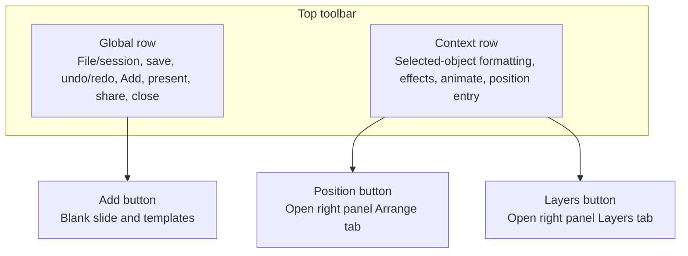

### Global Row

Keep global/session actions here:

- save status and save/retry;
- undo/redo;
- `Add` slide with template support;
- insert element and insert from document;
- slide format;
- deck theme;
- sync from document;
- simple/advanced mode;
- snap-to-grid toggle in advanced mode;
- keyboard shortcut help;
- present/share/close actions where applicable.

### Add Button Requirements

The top toolbar `Add` button is the only visible entry point for adding slides.

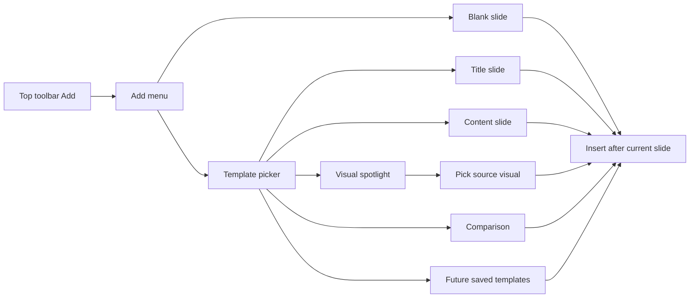

Rules:

- The left rail must not render an `Add slide` button.
- The bottom dock must not render an add-slide menu.
- The `Add` menu should support blank slides and template-based slides in one flow.
- Template insertion should preserve current deck mutation and autosave paths.
- Visual templates may open a visual picker before insertion.

### Contextual Row

The contextual row can show common selected-object tools. It should include entry points into the right panel rather than expanding every deep control inline.

Examples:

| Control                | Behavior                                                   |
| ---------------------- | ---------------------------------------------------------- |
| Font family/size/style | Direct quick edit for text-like selections.                |
| Effects/Animate        | Opens compact menu or right-panel tab, depending on depth. |
| Position               | Opens right panel `Arrange` tab.                           |
| Layers                 | Opens right panel `Layers` tab.                            |
| More                   | Holds overflow commands on narrow widths.                  |

## Left Slide Rail

The left rail is for navigation and ordering. It is not a creation surface.

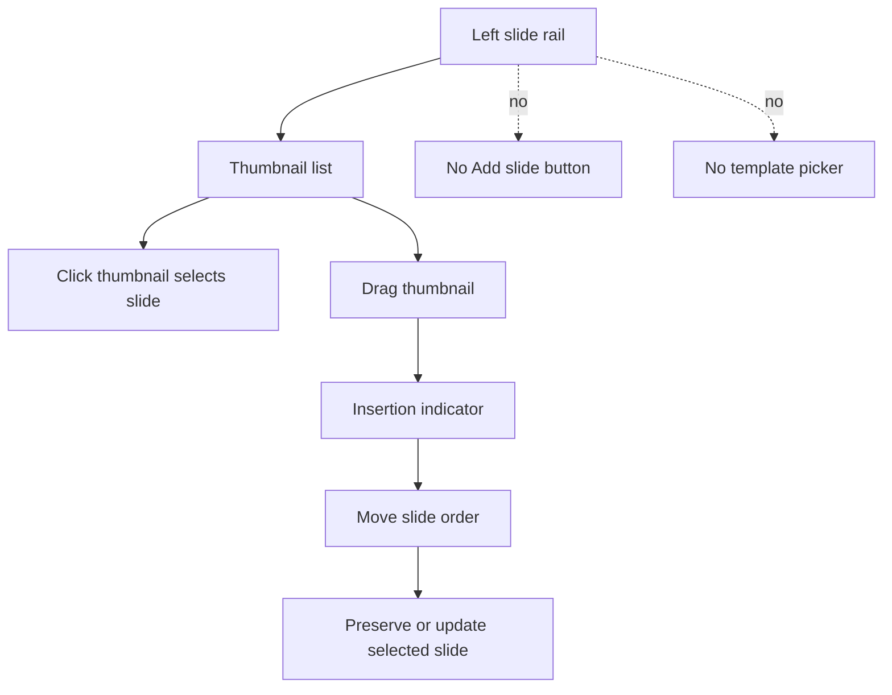

Required behavior:

- Shows slide thumbnails, slide number, selected state, and optional title.
- Supports drag and drop to reorder slides.
- Shows a clear insertion indicator while dragging.
- Updates slide numbers and selected state after reorder.
- Supports keyboard-accessible reorder through item menu or shortcuts.
- Can be shown or hidden through the bottom `Slides` button.
- Does not contain `Add slide`, template picker, notes, zoom, or object property controls.

Optional secondary actions:

- If duplicate/delete are needed, prefer top toolbar commands or a minimal thumbnail context menu.
- Avoid persistent per-thumbnail action clutter in the rail.
- Any duplicate flow that creates a slide should not become a primary visible add surface.

## Stage Column

The center column is the editing surface. It contains the context toolbar and stage canvas.

### Stage Responsibilities

- render `SlideCanvas` and editing chrome;
- hover preselection and selection frames;
- select one or many elements;
- move, resize, rotate;
- inline-edit text and bullet elements;
- edit connector endpoints and anchors;
- marquee select;
- keyboard movement, resize, traversal, delete, copy/paste;
- preserve selected/preselected frame visibility above overlapping elements.

### Selection State Flow

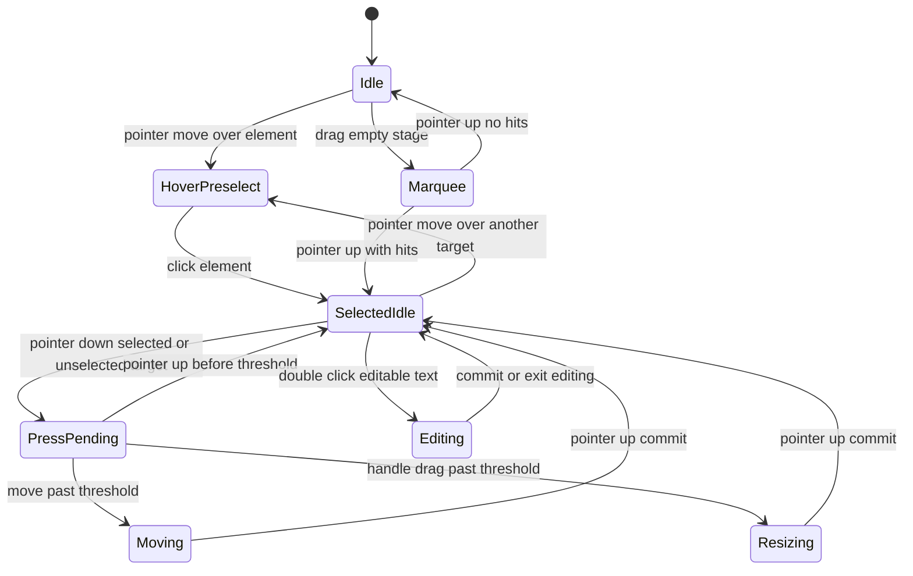

Important behavior:

- Selected is not the same as moving.
- In `SelectedIdle`, hover preselection should still work for lower elements under a selected shape.
- Actual drag/move starts only after crossing the movement threshold.
- Selection chrome is visual; it must not intercept pointer targeting.

## Context-Aware Toolbar

When a component is selected, show a top-centered toolbar below the page toolbar. It should be stable, predictable, and scoped to fast selected-object edits.

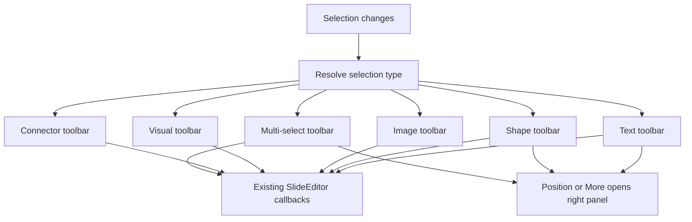

Placement rules:

- Fixed within the slide editor shell, not anchored to the selected element.
- Top-centered over the stage workspace.
- Below the page toolbar and below any staleness banner.
- Above stage content but below modal dialogs and menus.
- Hidden when no element or editable slide surface is selected.
- Lower-priority controls collapse into `More` on narrow widths.

Toolbar content:

| Selection    | Toolbar owns                                                                        |
| ------------ | ----------------------------------------------------------------------------------- |
| Text         | Font size, bold, italic, underline, color, alignment, quick fit, duplicate/delete.  |
| Bullets      | Text style, alignment, list type, indent/outdent, quick spacing, duplicate/delete.  |
| Shape        | Fill, stroke, stroke width, shape type, corner radius quick edit, duplicate/delete. |
| Image        | Replace, fit, crop entry, mask, quick radius, opacity, duplicate/delete.            |
| Visual       | Restyle presets, replace visual, stale-source quick indicator, duplicate/delete.    |
| Connector    | Stroke, width, dash, arrowheads, detach shortcuts, duplicate/delete.                |
| Group        | Enter group, ungroup, arrange, duplicate/delete.                                    |
| Multi-select | Align, distribute, match size, group, arrange, duplicate/delete.                    |

Toolbar should not own:

- exact X/Y/W/H/rotation fields;
- layer tree;
- source/ref workflows;
- image URL and alt text forms;
- speaker notes;
- zoom;
- slide creation.

## Right Panel

The right panel is the supplemental inspector. It adapts Canva's `Position` panel into a right-side surface and absorbs deeper controls that do not belong in the toolbar.

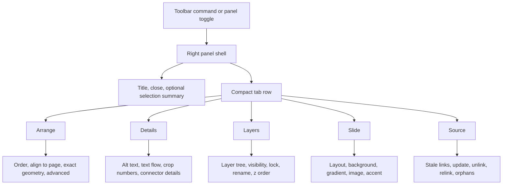

Panel tabs:

| Tab       | Purpose                                  | Contains                                                                                                                 |
| --------- | ---------------------------------------- | ------------------------------------------------------------------------------------------------------------------------ |
| `Arrange` | Canva-inspired position/order controls   | Forward/backward, to front/back, align to page, exact X/Y/W/H, rotation, ratio lock, advanced size controls.             |
| `Details` | Deep properties for the selected element | Alt text, text flow, line height, paragraph spacing, advanced crop numbers, connector endpoint details, source metadata. |
| `Layers`  | Whole-slide layer management             | Element tree, visibility, lock, rename, group membership, z-order reorder.                                               |
| `Slide`   | Slide-level settings                     | Layout apply/reset, background image, gradient, background asset, accent advanced settings.                              |
| `Source`  | Document/source-linked workflows         | Stale source links, update/unlink/relink, orphan handling, inserted document blocks.                                     |

Panel behavior:

- Opening `Position` or `Arrange` from the context toolbar opens `Arrange`.
- Opening `Layers` opens `Layers` in the same panel shell.
- If no element is selected, default to `Layers` or `Slide` depending on the last valid user intent.
- If one element is selected, default to the last selected tab if valid, otherwise `Arrange`.
- If a selection only needs toolbar controls, the panel may show a summary and links to relevant tabs rather than duplicate controls.
- The panel should be docked on wide screens and may float over the right edge of the stage on narrower screens.

No-duplication rules:

| Property/workflow                   | Primary surface                                                                 | Notes                                                        |
| ----------------------------------- | ------------------------------------------------------------------------------- | ------------------------------------------------------------ |
| Bold, italic, underline, text color | Context toolbar                                                                 | Do not repeat as editable panel controls.                    |
| Font family                         | Context toolbar if compact; otherwise right panel only                          | Avoid two font menus.                                        |
| Line height, paragraph spacing      | Right panel `Details`                                                           | Too detailed for the toolbar.                                |
| Exact X/Y/W/H/rotation              | Right panel `Arrange`                                                           | Canvas handles direct manipulation; panel handles precision. |
| Align/distribute                    | Context toolbar for quick actions; right panel only if opened through `Arrange` | Avoid simultaneous duplicates.                               |
| Layer tree, rename, hide, lock      | Right panel `Layers`                                                            | Panel owns list/tree workflows.                              |
| Image crop entry                    | Context toolbar                                                                 | Numeric crop values stay in `Details`.                       |
| Image alt text                      | Right panel `Details`                                                           | Accessibility metadata is a form.                            |
| Visual restyle swatches             | Context toolbar                                                                 | Source details stay in `Source`.                             |
| Source update/unlink/relink         | Right panel `Source`                                                            | A toolbar stale indicator may link here.                     |
| Speaker notes                       | Bottom dock                                                                     | Never in right panel.                                        |
| Zoom                                | Bottom dock                                                                     | Never in right panel or stage overlay.                       |

## Bottom Dock

The bottom dock is the persistent workspace utility band.

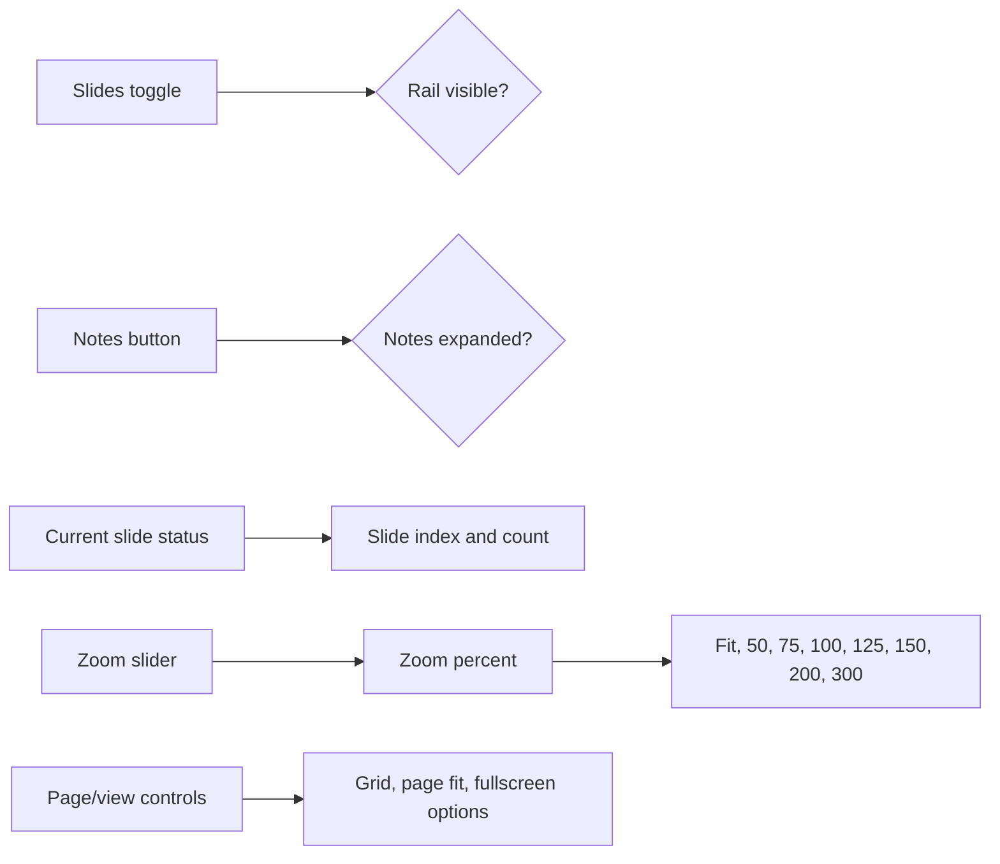

Bottom dock zones:

| Zone         | Controls                                         | Behavior                                                               |
| ------------ | ------------------------------------------------ | ---------------------------------------------------------------------- |
| Left         | `Slides`, `Notes`                                | Toggle rail and expand/collapse notes.                                 |
| Center       | Current slide status or compact slide strip      | Shows context without replacing the full left rail. No add-slide menu. |
| Right        | Zoom slider, percentage menu, page/view controls | Replaces the stage overlay zoom controls.                              |
| Expanded row | Speaker notes textarea                           | Resizable notes editor bound to `selectedSlide.notes`.                 |

Speaker notes:

- Open from a compact `Notes` button in the bottom dock.
- Expand into a resizable textarea above the bottom utility row.
- Continue routing through `UPDATE_SLIDE_NOTES`.
- Continue one undo step per focus session.
- Do not appear in the right panel.

Zoom:

- Range: `25%` to `300%`.
- Default: `100%`.
- Slider step: `5%` unless implementation needs finer input.
- Percent button opens presets: `Fit`, `50%`, `75%`, `100%`, `125%`, `150%`, `200%`, `300%`.
- `Fit` computes the largest zoom fitting the slide inside the current stage viewport after rail, panel, toolbar, and dock are accounted for.
- Remove the old bottom-right stage zoom overlay.

## Responsive Model

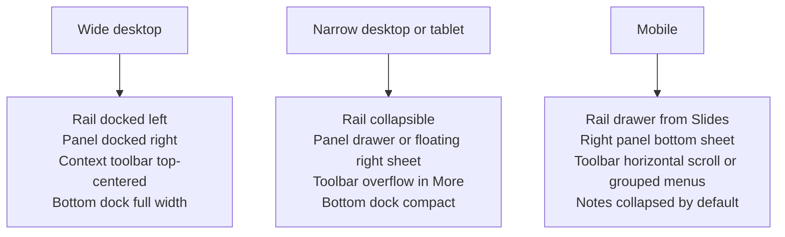

Responsive rules:

| Viewport              | Behavior                                                                                                                                                                      |
| --------------------- | ----------------------------------------------------------------------------------------------------------------------------------------------------------------------------- |
| Wide desktop          | Left rail visible by default, right panel docked when open, context toolbar centered over stage workspace, bottom dock full width.                                            |
| Narrow desktop/tablet | Rail can collapse through `Slides`; right panel may float/drawer from the right; toolbar collapses lower-priority controls into `More`.                                       |
| Mobile                | Rail opens as a drawer from `Slides`; right panel opens as a bottom sheet; context toolbar becomes horizontally scrollable or grouped into menus; notes collapsed by default. |

## State And Component Boundaries

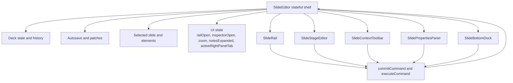

Existing state reused:

| State                                      | New UI owner                                                    |
| ------------------------------------------ | --------------------------------------------------------------- |
| `railOpen`                                 | Bottom `Slides` button.                                         |
| `inspectorOpen`                            | Right panel toggle and panel shell.                             |
| `zoom`                                     | Bottom zoom slider and percentage menu.                         |
| `selectedElementId` / `selectedElementIds` | Stage and context toolbar.                                      |
| `selectedSlide.notes`                      | Bottom speaker notes editor.                                    |
| `editorMode`                               | Top toolbar or panel header; affects toolbar and panel density. |

New local UI state likely needed:

| State                        | Purpose                                               |
| ---------------------------- | ----------------------------------------------------- |
| `notesExpanded`              | Collapsed vs expanded notes editor.                   |
| `notesHeight`                | User-resized notes height.                            |
| `zoomMenuOpen`               | Percentage preset menu.                               |
| `activeRightPanelTab`        | `Arrange`, `Details`, `Layers`, `Slide`, or `Source`. |
| `contextToolbarOverflowOpen` | `More` menu for compact widths.                       |
| `addMenuOpen`                | Top toolbar slide/template creation menu.             |

Suggested component split:

| Component              | Responsibility                                                                         |
| ---------------------- | -------------------------------------------------------------------------------------- |
| `SlideEditorLayout`    | CSS grid/flex shell for top toolbar, rail, stage column, panel, and bottom dock.       |
| `SlideTopToolbar`      | Global actions, top-level `Add` menu, and selected-object contextual row entry points. |
| `SlideRail`            | Thumbnail navigation and drag/drop reorder only.                                       |
| `SlideContextToolbar`  | Selection-derived quick controls and panel entry points.                               |
| `SlidePropertiesPanel` | Right-side `Arrange`, `Details`, `Layers`, `Slide`, and `Source` tabs.                 |
| `SlideBottomDock`      | `Slides` toggle, notes, zoom slider, percent menu, current slide status.               |

## Primary Interaction Flows

### Add Slide Or Template

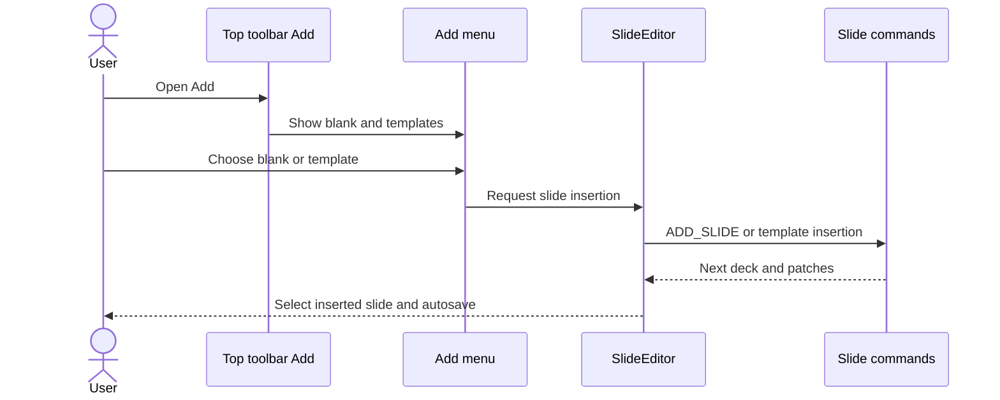

### Reorder Slides From Left Rail

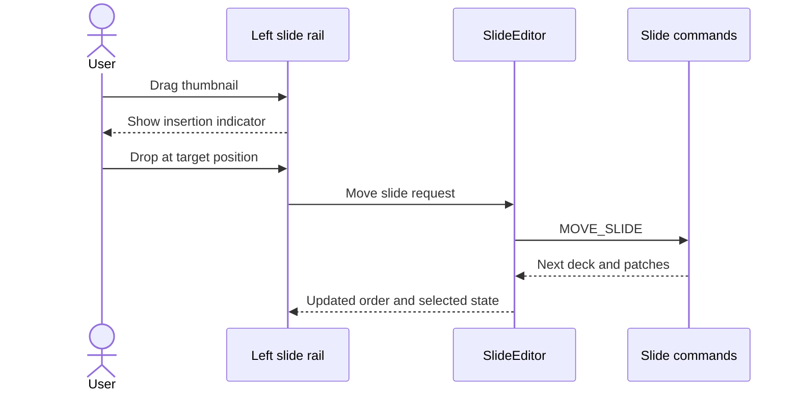

### Edit Selected Object

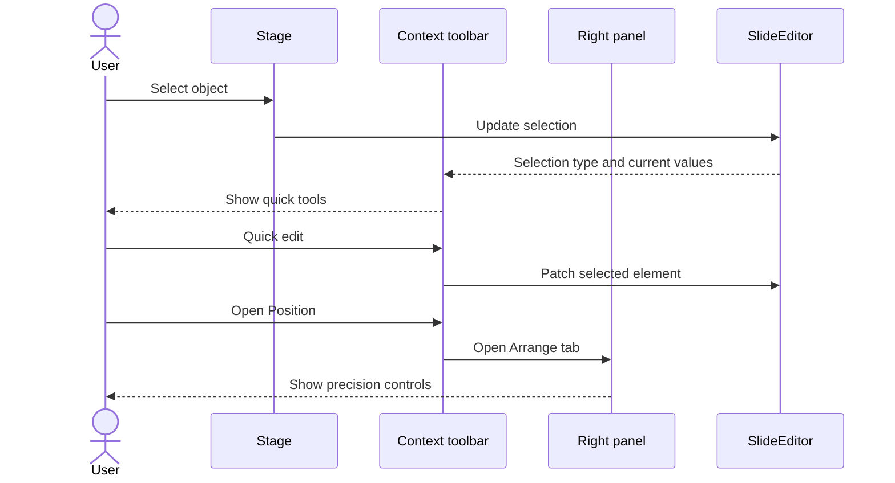

## Implementation Plan

1. Extract layout regions while preserving current state ownership.
2. Move slide creation into the top toolbar `Add` menu, including blank slide and template choices.
3. Remove any visible add/template entry from the left rail and bottom dock.
4. Keep the left rail focused on selection and drag/drop reorder.
5. Replace stage-overlay zoom controls with the bottom dock zoom slider and percentage menu.
6. Integrate speaker notes into the bottom dock with collapsed/expanded behavior.
7. Add `SlideContextToolbar` from current selection state and reuse compact controls such as `TextStyleBar` where possible.
8. Move common selected-object controls from the inspector into the context toolbar without changing mutation callbacks.
9. Refactor `SlideInspector` into `SlidePropertiesPanel` with `Arrange`, `Details`, `Layers`, `Slide`, and `Source` tabs.
10. Add responsive rail drawer, right-panel sheet/floating behavior, and toolbar overflow handling.
11. Verify keyboard access, focus order, screen-reader labels, drag/drop reorder, zoom, notes, and autosave behavior.

## Acceptance Criteria

- Slide thumbnails remain on the left on desktop.
- The left rail supports drag and drop to reorder slides.
- The left rail does not include an `Add slide` button.
- The left rail does not include a template picker.
- Slides are added only from the top toolbar `Add` button.
- The top toolbar `Add` button supports blank slides and template-based slides.
- A bottom `Slides` button can show and hide the left rail.
- Speaker notes are edited from the bottom dock and do not appear in the right panel.
- Zoom controls are in the bottom dock and use a horizontal slider.
- Clicking the zoom percentage opens preset ratios.
- Selecting a slide component shows a context-aware toolbar top-centered below the page toolbar.
- The context toolbar does not move based on the selected object's canvas position.
- Common selected-object property edits are available from the context toolbar.
- `Position` or `Arrange` opens the right panel's `Arrange` tab.
- The right panel is on the right and contains only supplemental controls, deep property forms, layers, source workflows, and slide-level advanced settings.
- No editable property control is duplicated between the context toolbar and the right panel.
- Existing deck mutation, autosave, undo/redo, keyboard navigation, and stage interaction behavior remain intact.

## Verification Notes

Implementation should include focused verification for:

- top toolbar `Add` menu with blank and template insertion;
- absence of add/template controls in the left rail;
- left rail drag/drop reorder and keyboard reorder alternative;
- page toolbar, context toolbar, stage, right panel, and bottom dock keyboard order;
- accessible names for icon-only toolbar buttons and zoom slider controls;
- selection changes across text, bullets, shape, image, visual, connector, group, and multi-select states;
- context toolbar overflow behavior;
- `Position` opening right panel `Arrange`;
- right panel tab switching and no duplicate editable controls;
- zoom slider drag, keyboard adjustment, and percentage menu selection;
- notes editing undo coalescing and autosave;
- responsive desktop, tablet, and mobile layouts.
