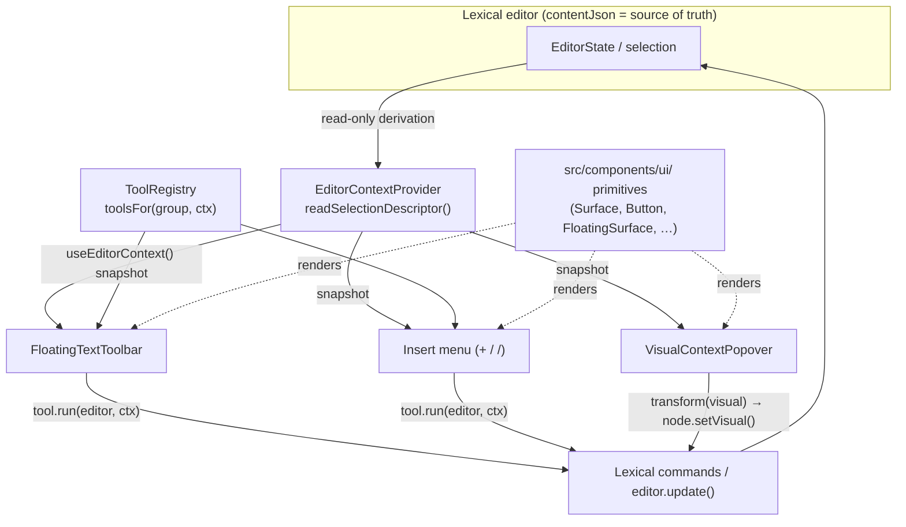

# Editor architecture & usage

The document editor pairs a Lexical rich-text surface with **visual blocks**
(flowcharts, mind maps, charts, …) and a set of **context-aware surfaces**
(a floating text toolbar, a `+`/`/` insert menu, and a per-visual editing
popover). This document explains how those pieces fit together and how to
extend them safely.

It describes the system that shipped in the Phases 0–4 editor redesign. No
application change is required to read it — it documents existing behavior and
the supported extension points.

## Overview & goals

The editor is built around three ideas:

1. **One place derives selection state.** Every contextual surface reads the
   same read-only [`EditorContextSnapshot`](../src/lib/lexical/editor-context.tsx)
   instead of running its own `selectionchange` listener or rect math.
2. **Tools are data, not bespoke components.** Each editing affordance
   (bold, "Heading 2", "Insert flowchart") is a declarative
   [`EditorTool`](../src/lib/lexical/tool-registry.ts) entry. Surfaces render
   the subset of tools whose `when()` predicate matches the current snapshot.
3. **Chrome and content are separate.** App chrome is themed with the `--ds-*`
   design-system tokens; visual _content_ colors live in the `Visual` payload
   and are independent of the chrome.

The result: adding a formatting tool, a visual kind, or a theme is a small,
local change — usually one object literal — and never requires touching a
surface's rendering or selection logic.

## Architecture



**Selection flows one way** (editor → snapshot → surfaces); **mutations flow
back through Lexical** (surface → command/`editor.update()` → editor state).

### EditorContext — the one derivation point

[`src/lib/lexical/editor-context.tsx`](../src/lib/lexical/editor-context.tsx)
owns all selection derivation.

- `EditorContextProvider` subscribes **once** to Lexical's update lifecycle
  (`registerUpdateListener` + `SELECTION_CHANGE_COMMAND` + the DOM
  `selectionchange` event for native-range rects), computes an
  `EditorContextSnapshot`, and exposes it via React context.
- `useEditorContext()` returns the current snapshot. Surfaces call this and
  nothing else — they never read `$getSelection()` themselves.
- `readSelectionDescriptor()` is the pure derivation: run inside an
  `editorState.read(...)` it returns the rect-free subset of the snapshot. It is
  exported so the logic can be unit-tested headlessly; the provider calls it
  identically.

Key `EditorContextSnapshot` fields:

| Field                          | Meaning                                                       |
| ------------------------------ | ------------------------------------------------------------- |
| `kind`                         | `range` \| `collapsed` \| `empty-block` \| `visual` \| `none` |
| `editable`                     | mirrors `editor.isEditable()`                                 |
| `blockType`                    | `paragraph`/`h1`/`h2`/`h3`/`quote`/`bullet`/`number`          |
| `activeFormats`                | `Set` of active inline formats (bold/italic/…/code)           |
| `elementFormat`                | block alignment (`""` = inherited/left)                       |
| `textColor` / `highlightColor` | inline color styles (`""` when unset)                         |
| `isLink`                       | selection sits within a link                                  |
| `blockKey`                     | **live, transient** key of the active block                   |
| `selectedVisualId`             | **stable** id of a selected `VisualNode` (safe to persist)    |
| `selectedVisualNodeKey`        | **live, transient** key of that node                          |
| `rects`                        | `selection` + `block` `DOMRect` snapshots for positioning     |

The provider is read-only: it never calls `editor.update()`, never touches Yjs,
and the only NodeKeys it exposes (`blockKey`, `selectedVisualNodeKey`) are
_live, transient_ keys meant for an immediate `editor.update()` — they are never
stored.

### ToolRegistry — data-driven tools

[`src/lib/lexical/tool-registry.ts`](../src/lib/lexical/tool-registry.ts)
defines the `EditorTool` model and a small registry.

An `EditorTool` declares:

- `id`, `group`, `label`, optional `icon`/`shortcut`/`section`/`description`/`keywords`.
- `when(ctx)` — **pure**: is the tool visible for this snapshot?
- `isActive?(ctx)` — **pure**: is it currently toggled on?
- `control?: "button" | "color"`:
  - **button** tools provide `run(editor, ctx)` — mutate via Lexical
    commands / `editor.update()`.
  - **color** tools provide `value(ctx)` (read the current color from the
    snapshot) and `apply(editor, value)` (write an inline style via
    `$patchStyleText`).

Groups partition tools by surface: `text-format`, `block-insert`,
`visual-insert`, `visual-edit`, `visual-style`.

Surfaces consume the registry through `toolsFor(group, ctx)`, which returns the
visible tools in registration order:

- [`floating-text-toolbar.tsx`](../src/app/app/documents/%5Bid%5D/floating-text-toolbar.tsx)
  renders `toolsFor("text-format", ctx)` as icon buttons above a non-collapsed
  selection.
- [`insert-menu.tsx`](../src/app/app/documents/%5Bid%5D/insert-menu.tsx)
  renders `toolsFor("block-insert", ctx)` and `toolsFor("visual-insert", ctx)`
  as grouped, filterable rows in the `+`/`/` menu.

Both surfaces are dumb renderers: they own positioning and keyboard handling but
delegate all behavior to `tool.run(...)` / `tool.apply(...)`.

### Shared UI primitives

[`src/components/ui/`](../src/components/ui/) (re-exported from
[`index.ts`](../src/components/ui/index.ts)) holds the surface primitives —
`Surface`, `Button`/`IconButton`, `SegmentedControl`, `FloatingSurface`,
`Tooltip`, `Divider`, `Swatch`, `ColorPicker`. They consume the `--ds-*` chrome
tokens, so every surface looks like one system in both light and dark mode.

Shared control class strings (focus ring, gutter button, toggle states) live in
[`src/components/motion/control-styles.ts`](../src/components/motion/control-styles.ts)
and compose the same tokens.

## Invariants (and why)

These are load-bearing. Breaking one quietly corrupts persistence or
collaboration.

1. **Tools mutate only through Lexical commands / `editor.update()` — never Yjs
   directly.** Yjs binding is driven by Lexical's collaboration plugin; writing
   to Yjs out of band desyncs the CRDT. Standard Lexical mutations (including
   `$patchStyleText`, which serializes into the `TextNode` style) are
   collab-safe. `when`/`isActive`/`value` stay pure so they are render-safe and
   unit-testable without a browser.
2. **Never persist NodeKeys.** `blockKey` and `selectedVisualNodeKey` are live
   keys, valid only within the current editor state. Anchor persistence uses the
   **stable** `visualId` instead (stored as a `Visual` row's `anchorBlockId`).
3. **`contentJson` is the single source of truth.** The serialized Lexical state
   is authoritative. The `Visual`/`VisualRevision` database rows are a _derived
   mirror_ of the `VisualNode`s inside it (see
   [Visual lifecycle](#visual-lifecycle)) — used for share/embed pages,
   thumbnails, and history, never read back as primary state.
4. **`--ds-*` chrome tokens are separate from visual-content `VisualStyle`.** The
   app's surfaces are themed with `--ds-*`
   ([`globals.css`](../src/app/globals.css), exposed to Tailwind via
   `@theme inline` and flipped in the `prefers-color-scheme: dark` block).
   A visual's own colors live in its `VisualStyle` (baked into the `Visual`
   payload) and must not be wired to `--ds-*` — a visual looks the same
   regardless of the app's light/dark chrome.

## How-to: extending the editor

### Add a new text / format tool

Append an `EditorTool` with `group: "text-format"` to `TEXT_FORMAT_TOOLS` in
[`tool-registry.ts`](../src/lib/lexical/tool-registry.ts). For a toggle, keep
`run` thin and dispatch a Lexical command:

```ts
{
  id: "format-subscript",
  group: "text-format",
  section: "inline",
  label: "Subscript",
  icon: Subscript,                 // from lucide-react
  when: onRangeSelection,          // existing helper: editable && kind === "range"
  isActive: (ctx) => ctx.activeFormats.has("subscript"),
  run: (editor) => toggleFormat(editor, "subscript"),
}
```

The tool appears in the floating toolbar automatically. For a color tool, set
`control: "color"` and provide `value(ctx)` + `apply(editor, value)` instead of
`run` (see `format-text-color`). If you track a new format in `isActive`, add it
to `EditorTextFormat` / `TEXT_FORMATS` in
[`editor-context.tsx`](../src/lib/lexical/editor-context.tsx) so the snapshot
reports it.

### Add a new visual kind / blank template

1. Add the kind to `VISUAL_KINDS` in
   [`src/lib/visual/schema.ts`](../src/lib/visual/schema.ts) and its uppercase
   form to `VISUAL_TYPES` (+ the `VISUAL_KIND_TO_PRISMA` /
   `PRISMA_TO_VISUAL_KIND` maps).
2. Add a `blank<Kind>()` builder returning a schema-valid `Visual` and register
   it in `BLANK_BUILDERS` in
   [`src/lib/visual/fixtures.ts`](../src/lib/visual/fixtures.ts). `createBlankVisual(kind)`
   picks it up — this is the deterministic, non-AI seed.
3. Add presentational metadata (label, icon, description, keywords) to
   `VISUAL_KIND_META` in `tool-registry.ts`. The `visual-insert` tool set is
   generated from `VISUAL_KINDS`, so the new kind shows up in the insert menu
   with no further wiring.
4. If it renders, teach the renderer/layout
   ([`src/components/visual/`](../src/components/visual/)) how to draw it.

### Add or change a theme

Append a `StyleTheme` to `STYLE_THEMES` in
[`src/lib/visual/themes.ts`](../src/lib/visual/themes.ts). A theme is a
`ThemeColors` patch (palette + base colors only — typography is preserved by
`applyTheme`). `applyTheme`/`isThemeActive` resolve themes dynamically from this
registry, so the new chip appears in the visual popover with no other change.
Keep `nodeText`-on-`nodeFill` contrast at WCAG AA (≥4.5:1).

### Add a new visual restyle control

Whole-visual and per-node edits are **pure transforms** in
[`src/lib/visual/transforms.ts`](../src/lib/visual/transforms.ts) (each takes a
`Visual` and returns a new one). Add or reuse a transform, then call it from
[`visual-context-popover.tsx`](../src/app/app/documents/%5Bid%5D/visual-context-popover.tsx)
through `onChange(transform(visual, …))`:

```ts
onChange(setVisualStyle(visual, { background: value }));
```

`VisualCard` applies the returned `Visual` via `node.setVisual(next)` inside
`editor.update()`. Keep transforms pure (no React/Lexical imports, never mutate
the input) so they round-trip through `safeParseVisual` and stay testable.

## Visual lifecycle

```
insert (deterministic or AI)  →  edit / restyle (theme-first)  →  persist / version
        VisualNode in contentJson            node.setVisual()            mirrorVisualNodes
```

### Insert

- **Deterministic (non-AI).** A `visual-insert` tool dispatches
  [`INSERT_VISUAL_COMMAND`](../src/lib/lexical/commands.ts) with
  `{ kind, afterNodeKey }`. The handler
  ([`insert-visual-plugin.tsx`](../src/app/app/documents/%5Bid%5D/insert-visual-plugin.tsx))
  delegates to `$insertBlankVisualAfter`
  ([`insert-visual.ts`](../src/lib/lexical/insert-visual.ts)), which builds a
  `VisualNode` from `createBlankVisual(kind)`, inserts it after the target
  block, and selects it as a `NodeSelection` — all in one `editor.update()`.
- **AI.** The visual popover's "variations" path calls `/api/generate` and
  applies a chosen candidate through the same `node.setVisual()` seam.

The `VisualNode` ([`visual-node.tsx`](../src/app/app/documents/%5Bid%5D/visual-node.tsx))
is a Lexical `DecoratorNode` that serializes `{ visual, visualId }` into
`contentJson` and renders via `VisualCard`.

### Edit / restyle (theme-first)

Selecting a card makes the snapshot `kind === "visual"` and surfaces the
[`VisualContextPopover`](../src/app/app/documents/%5Bid%5D/visual-context-popover.tsx).
A one-click **theme chip** is the primary restyle path (`applyTheme`); per-color
pickers, per-node overrides, and kind switching are progressive disclosure. Each
edit is a pure transform from `transforms.ts`, committed via `node.setVisual()`
inside `editor.update()`.

### Persist / version

On the debounced autosave, the serialized state is written to `contentJson`, and
`mirrorVisualNodes`
([`actions.ts`](../src/app/app/documents/%5Bid%5D/actions.ts)) walks it via
`collectVisualNodes`
([`visual-nodes.ts`](../src/lib/lexical/visual-nodes.ts)) and upserts one
`Visual` row per node (keyed by `visualId` → `anchorBlockId`, ordered by
`orderIndex`). A changed payload snapshots a `VisualRevision` first (history);
removed nodes prune their rows. Every payload is re-validated with
`safeParseVisual` before it is written, so a tampered visual can never be
persisted. Real-time collaboration is layered on Lexical via Yjs/`y-websocket`
(see [collab-deployment.md](./collab-deployment.md)); the database remains the
durable source of truth.

## Tests

Tests live next to the code they cover as `*.test.ts`, e.g.:

- [`editor-context.test.ts`](../src/lib/lexical/editor-context.test.ts) — selection derivation
- [`text-formatting.test.ts`](../src/lib/lexical/text-formatting.test.ts) — format commands at the document layer
- [`insert-visual.test.ts`](../src/lib/lexical/insert-visual.test.ts) — deterministic insert in a headless editor
- [`visual-edit-roundtrip.test.ts`](../src/lib/lexical/visual-edit-roundtrip.test.ts) — transform → `setVisual` → serialize round-trip
- [`transforms.test.ts`](../src/lib/visual/transforms.test.ts), [`schema.test.ts`](../src/lib/visual/schema.test.ts), [`fixtures.test.ts`](../src/lib/visual/fixtures.test.ts) — pure data layer

They run headlessly with `node --test` via `tsx` (no browser):

```bash
npm test
```
